<div align="center">

# 🧠 MemoryLink

### *기억을 잇다, 오늘을 기록하다*

**초기 치매·경도인지장애(MCI) 예방을 위한 종합 인지 건강 관리 앱**

<br>

[](https://flutter.dev)
[](https://dart.dev)
[](https://firebase.google.com)
[](https://ai.google.dev)
[](https://www.sqlite.org)

<br>

</div>

---

## 📱 앱 소개

MemoryLink는 **기억력 저하가 걱정되는 60~80대 사용자와 그 가족**을 위해 설계된 디지털 건강 관리 앱입니다.
7종의 인지 훈련 게임, AI 회상 대화, 스마트폰 센서 기반 보행 분석, 감정 일기를 하나의 앱에서 제공하며,
보호자와 실시간으로 건강 상태를 공유합니다.

---

## ✨ 주요 기능

<table>
  <tr>
    <td align="center" width="33%">
      <h3>🧠 인지 훈련</h3>
      <p>7종 게임 · 적응형 1~10단계<br>비교·수열·스도쿠·구구단<br>분류·도형·문장 읽기</p>
    </td>
    <td align="center" width="33%">
      <h3>🚶 보행 분석</h3>
      <p>스마트폰 센서 기반<br>걸음 수 · 보폭 · 변동성(CV)<br>일별·주별 활동 차트</p>
    </td>
    <td align="center" width="33%">
      <h3>🤖 AI 회상 대화</h3>
      <p>Google Gemini 기반<br>회상 요법 챗봇<br>날씨·날짜 컨텍스트 자동 반영</p>
    </td>
  </tr>
  <tr>
    <td align="center" width="33%">
      <h3>📔 감정 일기</h3>
      <p>달력 기반 Memory Garden<br>날짜별 자유 서술 일기<br>작성 알림 기능</p>
    </td>
    <td align="center" width="33%">
      <h3>📊 주간 리포트</h3>
      <p>4개 인지 영역 점수 추이<br>익명 집단 백분위 비교<br>임상 참고용 PDF 생성·공유</p>
    </td>
    <td align="center" width="33%">
      <h3>👨‍👩‍👧 보호자 연계</h3>
      <p>QR 코드 연결<br>웹 대시보드 실시간 모니터링<br>이상 활동 감지 자동 알림</p>
    </td>
  </tr>
</table>

---

## 📸 스크린샷

<div align="center">
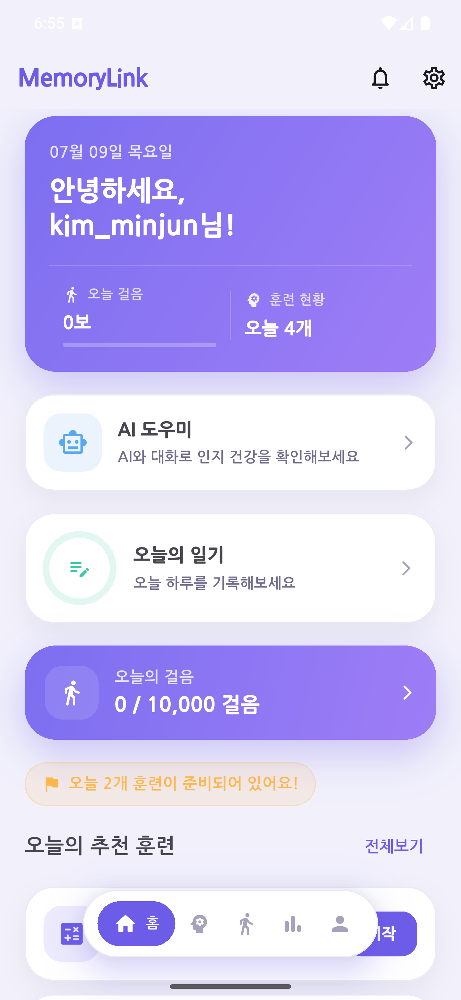
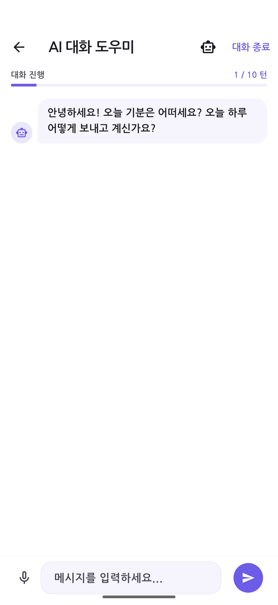
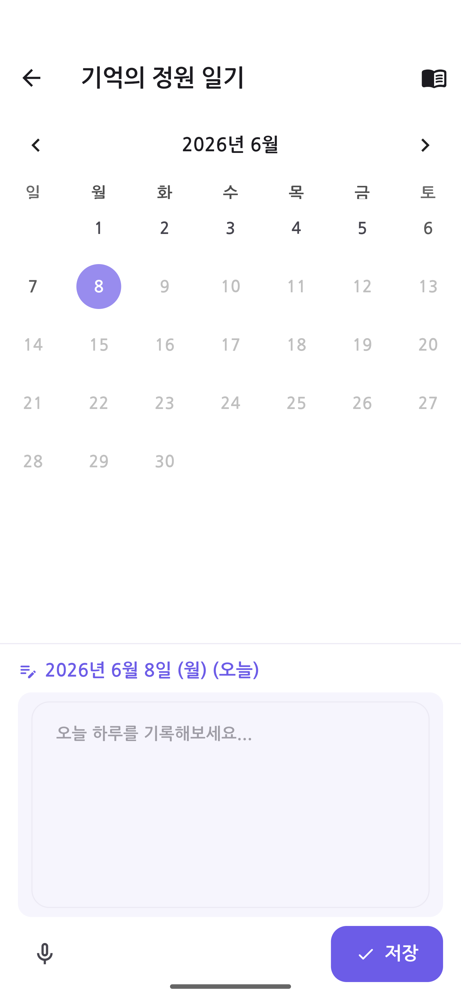
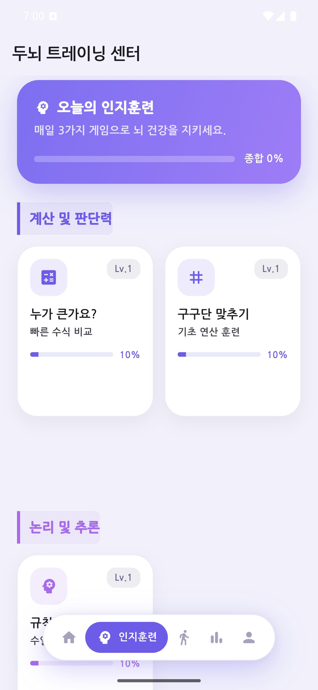
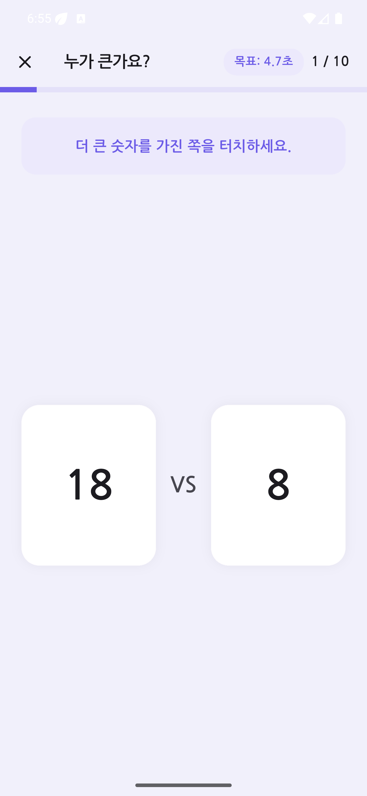
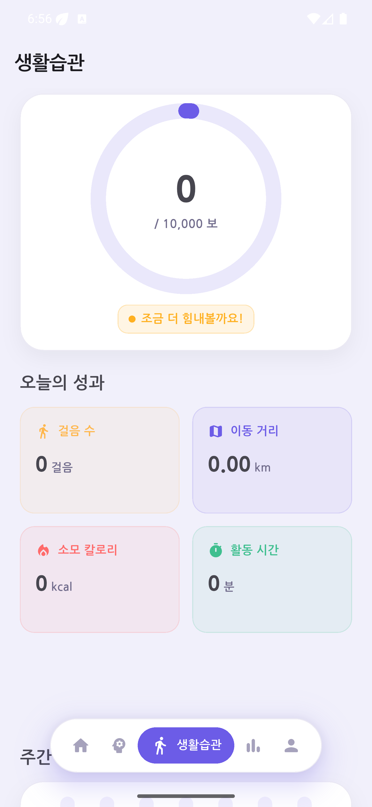
</div>

<br>

<div align="center">
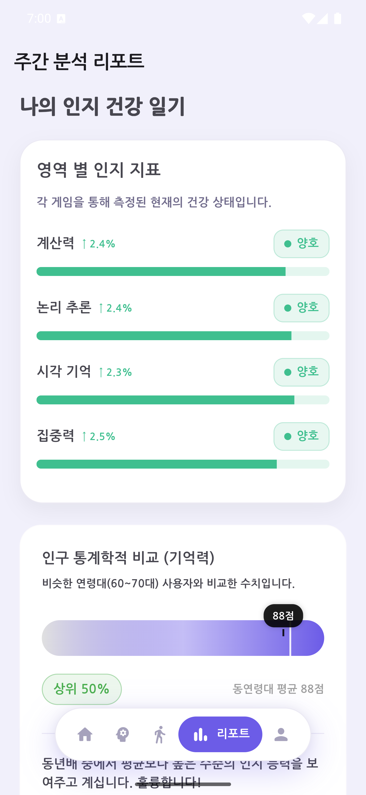
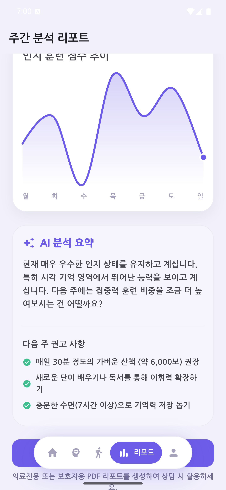
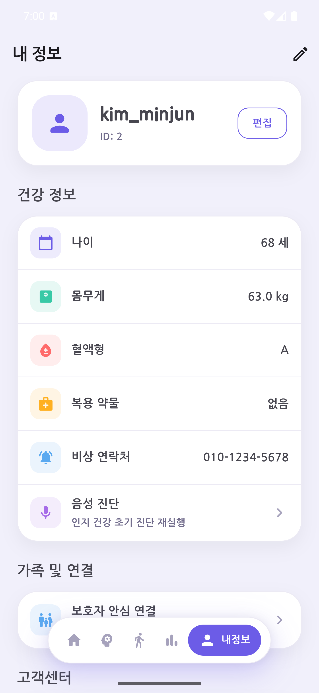

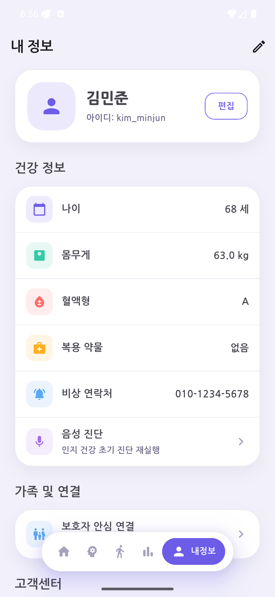
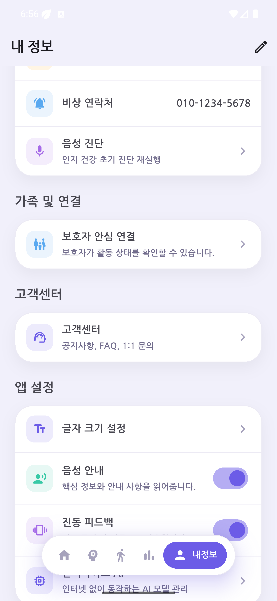
</div>

---

## 🎬 기능별 시연 영상

실제 앱 시연 영상을 기능별 클립으로 나눴습니다. **클립을 클릭하면 GitHub에서 바로 재생됩니다.**

| 클립 | 내용 | 길이 |
|---|---|:---:|
| [▶ 로그인 · 홈 화면](docs/demo/01_login_home.mp4) | 온보딩 → 로그인 → 홈 대시보드 | 14초 |
| [▶ 주요 탭 둘러보기](docs/demo/02_main_tabs.mp4) | 인지훈련 · 생활습관 · 리포트 · 내 정보 | 23초 |
| [▶ 인지 훈련 7종 게임](docs/demo/03_cognitive_training.mp4) | 비교 · 구구단 · 규칙찾기 · 스도쿠 · 범주화 · 회상 · 문장읽기 | 57초 |
| [▶ 만보기 · 보행 분석](docs/demo/04_walking_lifestyle.mp4) | 걸음 수 측정 · 보행 정밀 분석 | 15초 |
| [▶ 주간 · 임상 리포트](docs/demo/05_reports.mp4) | 영역별 인지 지표 · 임상 리포트 생성 · 공유 | 20초 |
| [▶ AI 회상 대화](docs/demo/06_ai_chat.mp4) | Gemini 기반 회상 요법 챗봇 | 29초 |
| [▶ 기억의 정원 (일기)](docs/demo/07_memory_garden.mp4) | 달력 기반 일기 작성 · 모아보기 | 11초 |
| [▶ 보호자 연결 · 안전 기능](docs/demo/08_guardian_safety.mp4) | QR 연결 · 웹 대시보드 · 응급 전화 · FAQ | 21초 |

---

## 🔢 숫자로 보는 MemoryLink

<div align="center">

| 항목 | 수치 |
|:---:|:---:|
| 🎮 인지 훈련 게임 | **7종** |
| 📈 인지 평가 영역 | **4개** (계산·논리·기억·집중) |
| 🎯 적응형 난이도 | **10단계** |
| 📋 PDF 리포트 | **4페이지** |
| 🧪 자동화 테스트 | **flutter test 117 · Maestro E2E 17 flow** |
| 📲 화면 수 | **30+** |

</div>

---

## 🚶 핵심 지표 — 보행 변동성 (CV)

MemoryLink의 가장 핵심적인 분석 지표는 보행 리듬의 불규칙성을 수치화한 **변동성 계수(CV, Coefficient of Variation)** 입니다.

스마트폰 가속도계로 연속 걸음 사이 시간 간격 $T_1, T_2, \ldots, T_n$ 을 수집해 실시간으로 계산합니다.

$$CV = \frac{\sigma}{\mu} \times 100\%$$

$$\mu = \frac{1}{n}\sum_{i=1}^{n} T_i, \qquad \sigma = \sqrt{\frac{1}{n}\sum_{i=1}^{n}(T_i - \mu)^2}$$

<div align="center">

| CV 범위 | 판정 | 의미 |
|:---:|:---:|:---|
| **< 5%** | 🟢 정상 | 규칙적인 보행 리듬 |
| **5 – 10%** | 🟡 경고 | 경미한 불규칙성 |
| **> 10%** | 🔴 고위험 | 치매·낙상 위험 전조 신호 |

</div>

> 이중 과제(Dual-Task) 모드에서는 3분 보행 중 40초마다 인지 미션을 제시합니다.  
> 치매 환자는 인지 부하 시 CV가 현저히 증가하는 특성을 활용합니다.

➡ 전체 수식 및 알고리즘: [GAIT_ANALYSIS.md](GAIT_ANALYSIS.md)

---

## 🛠 기술 스택

<div align="center">

**모바일 프레임워크**


**백엔드 & 데이터**


**AI & 센서**


**UI & 시각화**


</div>

---

## 🚀 시작하기

```bash
# 1. 의존성 설치
flutter pub get

# 2. (선택) Gemini API 키 설정
# lib/core/ai/ai_key_service.dart 에서 API 키 입력

# 3. 앱 실행
flutter run
```

> **플랫폼별 필요 사항**
> - Android: Android SDK + 기기 또는 에뮬레이터
> - iOS: macOS + Xcode + CocoaPods + 서명 설정
> - Firebase 기능: 플랫폼별 `google-services.json` / `GoogleService-Info.plist`

---

## 🏗 아키텍처

### 전체 시스템 구조

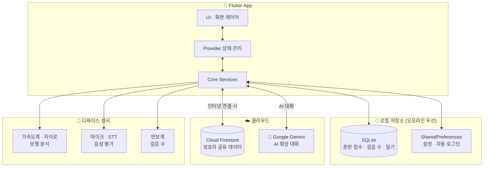

---

### 앱 화면 네비게이션 플로우

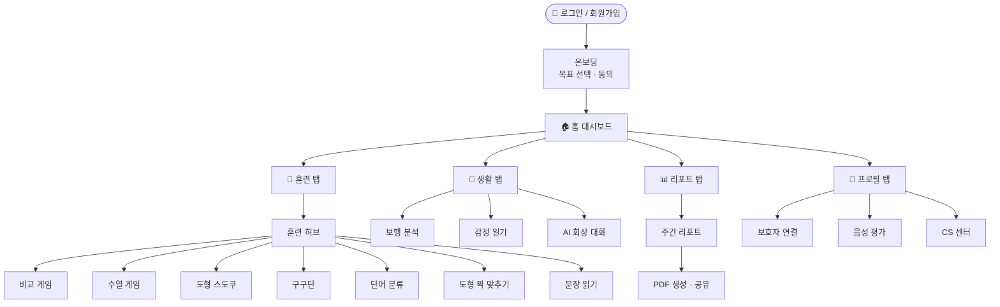

---

### 적응형 난이도 알고리즘

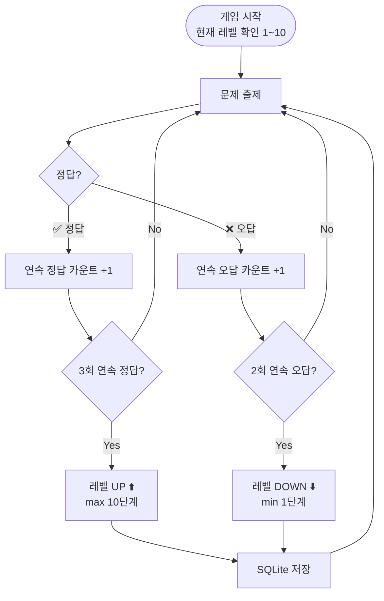

---

### 데이터 흐름 — 로컬 우선 전략

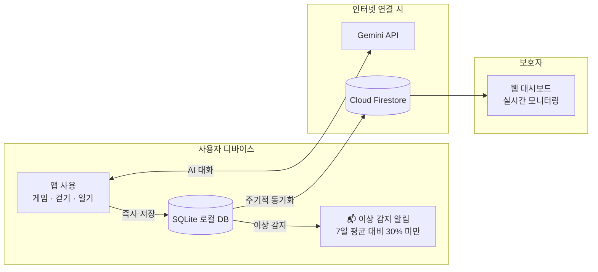

---

<details>
<summary>📁 프로젝트 폴더 구조 펼치기</summary>

```
lib/
├── core/                     공통 기반
│   ├── theme.dart            Lavender Calm 디자인 시스템 (#6C5CE7)
│   ├── router.dart           GoRouter 경로 설정
│   ├── database_helper.dart  SQLite 로컬 DB
│   ├── firebase_service.dart Firestore 동기화
│   └── ai/                   Gemini + 로컬 폴백 AI 모듈
│
└── features/                 기능별 화면
    ├── auth/                 로그인 · 회원가입
    ├── training/             인지 훈련 허브 + 7종 게임
    ├── gait_analysis/        보행 분석 · 걷기 대시보드
    ├── diary/                감정 일기 (Memory Garden)
    ├── ai_chat/              AI 회상 대화
    ├── reports/              주간 리포트 · PDF 생성
    ├── voice_assessment/     음성 평가 (STT + 언어 지표)
    ├── profile/              프로필 · 보호자 연결
    ├── cs/                   고객 지원 센터
    └── admin/                관리자 대시보드
```

</details>

---

<details>
<summary>📋 전체 화면 경로 목록 펼치기</summary>

```
/login                         로그인
/register                      회원가입
/                              메인 탭 (홈·훈련·생활·리포트·프로필)
/onboarding                    온보딩
/consent                       데이터 수집 동의
/assessment                    초기 인지 평가
/voice_assessment              음성 평가
/training_hub                  인지 훈련 허브
/game/comparison               비교 게임
/game/sequence                 수열 게임
/game/sudoku                   도형 스도쿠
/game/multiplication           구구단 게임
/game/shape_match              도형 짝 맞추기
/game/categorization           단어 분류
/game/reading                  문장 읽기
/gait                          보행 분석
/walking_dashboard             걷기 대시보드
/memory_garden                 일기 작성
/diary_book                    일기 조회
/ai_chat                       AI 회상 대화
/report_options                임상 리포트 옵션
/profile                       프로필
/guardian_link                 보호자 연결
/cs_center                     CS 센터
/admin_login                   관리자 로그인
/admin/dashboard               관리자 대시보드
```

</details>

<details>
<summary>🧪 QA 현황 펼치기</summary>

| 테스트 유형 | 수량 |
|---|---|
| flutter test (단위·위젯) | 117개 통과 |
| 통합 테스트 | 5개 |
| Maestro E2E flow | 17개 통과 (게이팅) + 스크린샷 투어 |

```bash
flutter analyze
flutter test
flutter test integration_test/
maestro test maestro/
flutter build apk
```

</details>

<details>
<summary>📌 현재 구현 상태 펼치기</summary>

| 영역 | 상태 |
|---|---|
| 인증 | 로컬 SQLite 계정 + Firebase Anonymous Auth (Firestore 소유권 모델 적용) |
| 인지 훈련 | 7종 게임 + 적응형 난이도 완료 |
| 보행 분석 | 센서 기반 분석 완료, HealthKit 실기기 검증 필요 |
| AI 대화 | Gemini REST API + 로컬 폴백 완료 |
| 리포트 | 차트 + 4페이지 PDF 생성 완료 |
| 보호자 연계 | Firestore 공유 + 로컬 이상 알림 완료 |
| 음성 평가 | STT + 규칙 기반 지표(TTR/WPM) 완료 |
| 관리자 | CS 관리 + 사용자 조회 화면 완료 |
| 설정·건강 기록 | 통합 설정 화면(`/settings`) + 혈압·혈당 등 건강 기록 입력 완료 |

</details>

<details>
<summary>🚀 출시 준비 현황 펼치기 (2026-07 기준)</summary>

| 항목 | 상태 |
|---|---|
| 패키지명 | `com.teammemorylink.memorylink` 전환 완료 |
| release AAB 빌드 | 서명 빌드 성공 (R8 minify + resource shrink) |
| Firebase Anonymous Auth | 도입 완료 — 앱 시작 시 자동 익명 로그인, 실패 시 로컬 모드 |
| Firestore 보안 규칙 | 소유권 기반 규칙 작성·배포 완료 (비인증 접근 차단 검증) |
| 개인정보 처리방침 | [memorylink-7af26.web.app/privacy.html](https://memorylink-7af26.web.app/privacy.html) 배포 완료 |
| 남은 작업 | 실기기 QA (센서·알림·Health Connect·PDF 공유·보호자 딥링크) |

</details>

---

## 📄 관련 문서

- [GAIT_ANALYSIS.md](GAIT_ANALYSIS.md) — 보행 분석 알고리즘 · 전체 수식 상세
- [PROJECT_DOCS.md](PROJECT_DOCS.md) — 기능 및 아키텍처 상세
- [capstone_project_plan_renewal.md](capstone_project_plan_renewal.md) — 캡스톤 설계 계획

---

<div align="center">

> ⚠️ **의료 면책 고지**
>
> MemoryLink는 **연구·캡스톤 프로토타입**입니다.
> 의료기기 또는 임상적으로 검증된 소프트웨어(SaMD)가 아니며,
> 앱 내 결과를 진단·치료 판단에 사용해서는 안 됩니다.

<br>

**2026 캡스톤 디자인 프로젝트** · 팀 MemoryLink

[](mailto:teammemorylink@gmail.com)

</div>
